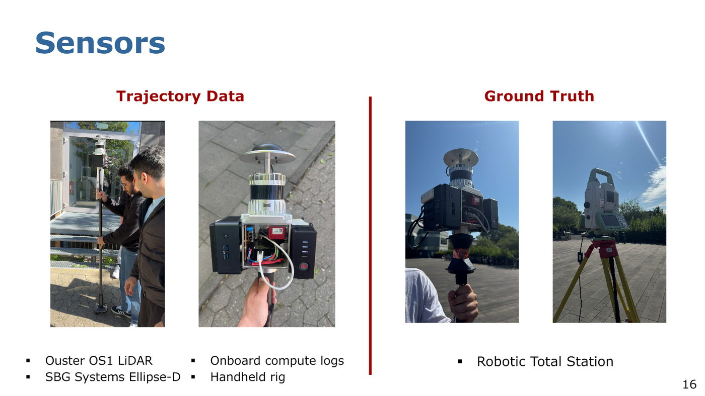
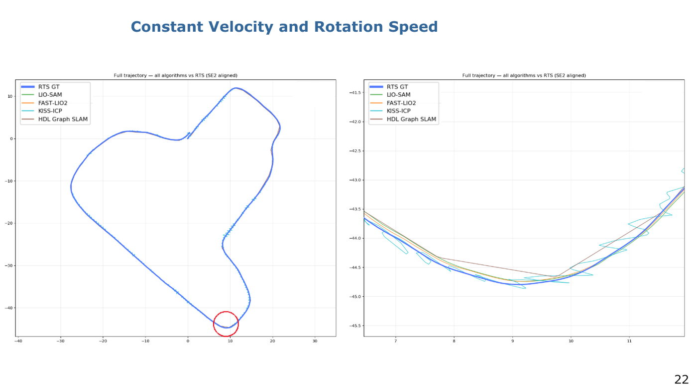
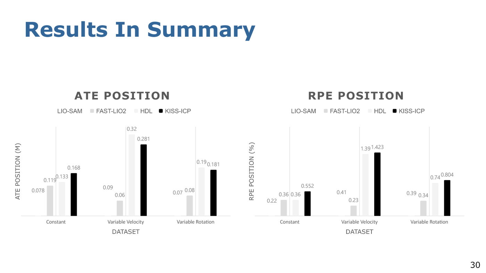
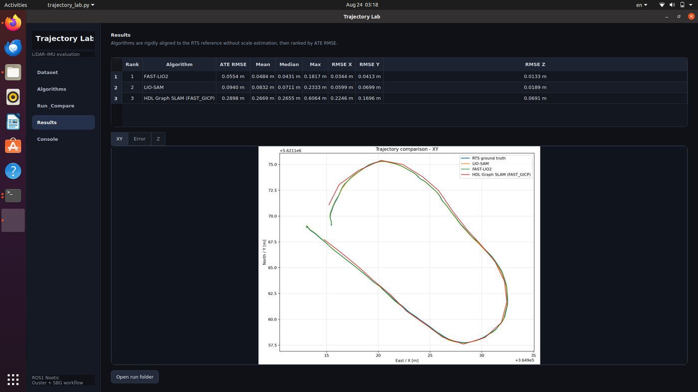
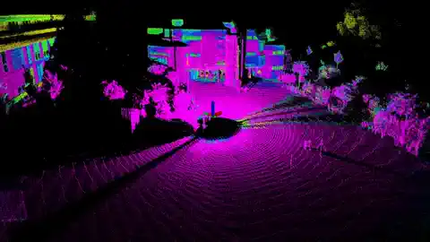

# Trajectory Lab

A PyQt5 toolbox for comparing LiDAR and LiDAR–inertial trajectory estimates on the same sensor recording, with RTS reference measurements and Trajectopy evaluation. Developed in a University of Bonn Mobile Robotics team project.


## Pipeline

Ouster PCAP + metadata and SBG BIN → synchronized ROS bag → sequential algorithm runs → trajectory export → Trajectopy matching, rigid alignment, ATE and RPE.

| Algorithm | Input topics | Evaluated output |
| --- | --- | --- |
| LIO-SAM | `/points_raw`, `/imu_raw` | `/lio_sam/mapping/odometry` |
| FAST-LIO2 | `/points_raw`, `/imu_raw` | `/Odometry`; no added loop-closure backend |
| HDL Graph SLAM | `/points_raw` | Optimized keyframe poses from the graph dump |

The bundled HDL profile uses NDT_OMP for registration and loop verification, with LM/CHOLMOD (`lm_var_cholmod`) and a Huber loop kernel. KISS-ICP remains an unconfigured placeholder.

## Project photos



*Project hardware shown in the team presentation: the handheld Ouster/SBG rig, onboard computer, and robotic total station used for reference measurements.*

## Presentation-reported results





The presentation reports the following values. ATE is in metres and RPE is in percent, following the labels in the slides.

| Dataset | Algorithm | ATE | RPE |
| --- | --- | ---: | ---: |
| Constant velocity and rotation | LIO-SAM | 0.077 | 0.216 |
| Constant velocity and rotation | FAST-LIO2 | 0.119 | 0.359 |
| Constant velocity and rotation | HDL Graph SLAM | 0.133 | 0.361 |
| Constant velocity and rotation | KISS-ICP | 0.168 | 0.552 |
| Variable velocity | LIO-SAM | 0.085 | 0.406 |
| Variable velocity | FAST-LIO2 | 0.056 | 0.231 |
| Variable velocity | HDL Graph SLAM | 0.316 | 1.394 |
| Variable velocity | KISS-ICP | 0.281 | 1.423 |
| Variable rotation speed | LIO-SAM | 0.074 | 0.389 |
| Variable rotation speed | FAST-LIO2 | 0.078 | 0.340 |
| Variable rotation speed | HDL Graph SLAM | 0.193 | 0.744 |
| Variable rotation speed | KISS-ICP | 0.181 | 0.804 |

## Application screenshots



*Trajectory Lab results view from an earlier exported run. This screenshot correctly identifies that run's HDL front end as FAST_GICP.*

[](docs/images/rviz-map.m4v)

[▶ Open the full-quality RViz video](docs/images/rviz-map.m4v)

*RViz point-cloud map and estimated path from project development.*

## Example Trajectopy result

The table below is a historical result from the local `variableV` dataset using RTS ground truth and Trajectopy 4.3.3. It is included as an example of the evaluation output, not as a universal algorithm ranking.

| Runtime configuration | ATE mean | ATE RMS 3D | ATE median | ATE max | Mean position RPE | Matched poses |
| --- | ---: | ---: | ---: | ---: | ---: | ---: |
| FAST-LIO2 | 0.0484 m | 0.0554 m | 0.0430 m | 0.1816 m | 0.3001% | 504 |
| LIO-SAM | 0.0872 m | 0.0980 m | 0.0753 m | 0.2187 m | 0.6151% | 166 |
| HDL Graph SLAM (FAST_GICP + LM + loops) | 0.2669 m | 0.2898 m | 0.2655 m | 0.6064 m | 1.3572% | 24 |


Evaluation used nearest temporal matching with a 0.05 s maximum difference, rigid 6-DoF alignment, and no scale, time-shift or lever-arm estimation. Position RPE used 5 m steps over an effective 5–48.664 m range. Rotational metrics are unavailable because the exported estimated trajectories contain no orientation. The machine-readable historical summary and evaluation settings are under [`results/variableV-historical`](results/variableV-historical/).

## Hardware and synchronization

The project uses Ouster OS1-128 (1024 × 10), SBG Ellipse-D, and robotic total station ground truth. The team collected handheld campus recordings near the MNL library, with intended differences in speed and rotation. Motion conditions were not precisely controlled.

The converter reads the PPS/NMEA settings from metadata and subtracts `nmea_leap_seconds` from Ouster timestamps (37 seconds for this rig). It does not fit an arbitrary timestamp offset or stretch time. The SBG converter uses UTC anchors and converts orientation from NED to ENU while retaining the body axes for acceleration and angular velocity.

PointCloud2 includes `x,y,z,intensity,t,reflectivity,ring,noise,range`; `t` contains relative nanoseconds within a scan. Extrinsic parameters are rig-specific: do not assume the supplied matrices are suitable for another rig.

## Setup and run

The exported project targets Ubuntu 20.04 / ROS Noetic. Follow [setup instructions](docs/setup.md). Dependencies are installed separately; their source trees are not included here.

```bash
source /opt/ros/noetic/setup.bash
source ~/ws_livox/devel/setup.bash
source ~/catkin_ws/devel/setup.bash
bash app/run_gui.sh
```

Select the PCAP, matching JSON metadata, SBG BIN, and RTS `.traj`. Check the displayed ground-truth path, choose the algorithms, validate the dataset, and run. Auto-detection prefers `rts*.traj`; if none exists, the imported GUI falls back to another `.traj`, so manual verification matters.

Trajectopy reads the RTS trajectory using its native file reader. Timestamps must represent the same time base as the estimates, and positions must be in consistent metric coordinates. The estimate exporter writes `#fields t,l,px,py,pz,vx,vy,vz`. It currently omits orientation; rotational comparisons are therefore unavailable for these exports.

Evaluation uses nearest temporal matching and rigid translation/rotation alignment, with scale, time shift and lever-arm estimation disabled. RPE defaults to 5–50 m pairs in 5 m steps; the evaluator adapts the range for short paths and saves the effective settings. Local plot coordinates do not change evaluation coordinates.

Run folders contain sensor/result bags, exported trajectories, algorithm logs, the comparison manifest, and evaluation files. Native Trajectopy outputs include aligned trajectories, ATE/RPE CSVs, alignment data, metrics and plots. Generated outputs remain outside Git.

## Code layout

- `app/`: GUI, pipeline, converters, evaluation and imported helper scripts. Files remain together to preserve their relative-path imports.
- `config/`: project sensor settings for LIO-SAM and FAST-LIO2.
- `launch/`: project FAST-LIO2 launcher; HDL launcher remains in `app/` beside its installer.
- `scripts/`: reversible configuration installation.
- `docs/`: setup, provenance and limitations.

To add an algorithm, add a profile through the GUI or `app/algorithms.json` with a unique ID, launch command and `nav_msgs/Odometry` topic. The pipeline records that topic by default; graph-based final-pose exports require an explicit result adapter, as used for HDL.

## Contributions and results

Ali Shouman's reported contribution includes LIO-SAM setup and application across the collected datasets, sensor-data preparation, configuration of sensor transforms, trajectory evaluation and participation in data collection. Conversion and evaluation tools were developed with AI coding assistance. Detailed GUI authorship and team credits still need confirmation.

## Dependencies and credits

- [LIO-SAM](https://github.com/TixiaoShan/LIO-SAM)
- [FAST-LIO](https://github.com/hku-mars/FAST_LIO)
- [hdl_graph_slam](https://github.com/koide3/hdl_graph_slam)
- [ndt_omp](https://github.com/koide3/ndt_omp) and [fast_gicp](https://github.com/SMRT-AIST/fast_gicp)
- [Trajectopy](https://github.com/gereon-t/trajectopy)
- [Ouster ROS](https://github.com/ouster-lidar/ouster-ros) and [Ouster SDK](https://github.com/ouster-lidar/ouster-sdk)
- [Livox ROS driver](https://github.com/Livox-SDK/livox_ros_driver)

These are upstream projects, not algorithms authored by this toolbox's contributors. Included LIO-SAM and FAST-LIO configuration/launch material retains the corresponding license texts in `licenses/`. A license for the application itself has not yet been selected; this draft does not grant a new license over team contributions.

